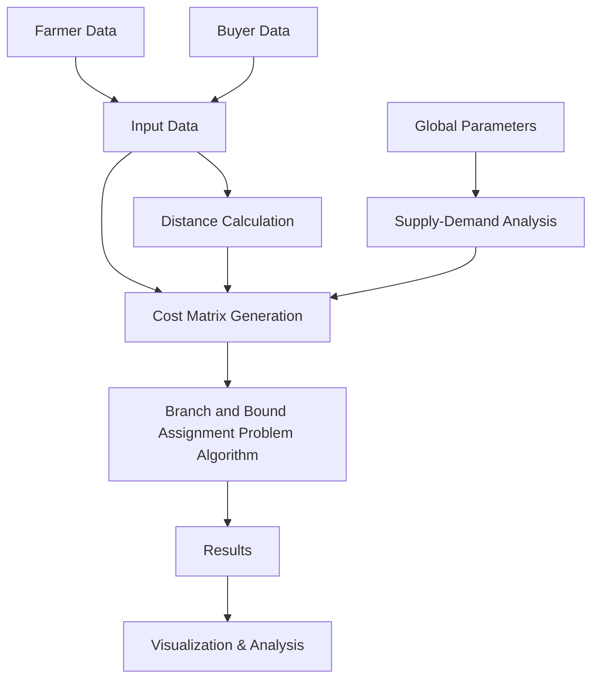

<div align="center">

# CropChain - Smart Agricultural Supply Chain Optimizer

</div>

<div align="center">
  
  
  
  
</div>

<div align="center">
  <h3>Revolutionizing Agricultural Supply Chain Management Through Intelligent Optimization</h3>
  <p><em>Connecting farmers and buyers with data-driven precision</em></p>
</div>

---

## About CropChain

**CropChain** is a prototype web-based platform designed to connect farmers directly to the market through optimal and efficient pairing. By providing a platform for efficient crop handling and trade, CropChain empowers farmers and ensures that they get fair access to buyers, reduce post-harvest losses, and improve overall market efficiency

Our platform transforms the traditional, often inefficient agricultural marketplace into a smart, data-driven ecosystem that benefits both producers and consumers.

---

## Tech Stack

<div align="center">

| Technology | Version | Purpose |
|------------|---------|---------|
| [](https://react.dev/) | `18.2.0` | Frontend Framework |
| [](https://vitejs.dev/) | `4.4.5` | Build Tool & Dev Server |
| [](https://developer.mozilla.org/en-US/docs/Web/JavaScript) | `ES6+` | Programming Language |
| [](https://www.chartjs.org/) | `4.4.0` | Data Visualization |
| [](https://leafletjs.com/) | `1.9.4` | Interactive Maps |
| [](https://tailwindcss.com/) | `3.3.0` | Styling Framework |
| [](https://nodejs.org/en) | `18.0+` | Runtime Environment |
| [](https://expressjs.com/) | `4.18.0` | Backend Framework |

</div>

---

## Problem Statement

### The Challenge

Agricultural supply chains in the Philippines are inefficient:

* **Mismatched Supply & Demand**: Farmers can’t find reliable buyers, leading to wasted crops and lost income. Buyers face inconsistent supply and delivery.
* **Poor Logistics**: Remote farmers lack market access. Weak infrastructure causes up to 30% crop waste and high transport costs.
* **Unfair Pricing**: Oversupply crashes prices below production costs. Manual systems and middlemen often result in unfair deals.
* **Post-Harvest Losses**: Slow distribution leads to spoilage and waste.
* **Lack of Market Info**: Farmers have little visibility into market needs or prices.

---

### Our Solution: CropChain

* **Smart Matching**: Uses algorithms to pair farmers with buyers based on crop availability, demand, location, and logistics.
* **Cost Analysis**: Calculates transport and supply costs using a flexible, heuristic-based model.
* **Transparent Outputs**: Shows clear farmer-buyer assignments, transport costs, and crop summaries—plus planned routing maps.
* **Data Tools for Farmers & Policy Makers**: Helps farmers access markets directly, reduce waste, and boost efficiency. Scalable for use by the Department of Agriculture.

---

## Features

### Core Functionality
- **Smart Assignment Algorithm**: Branch and Bound Assignment Problem Solver implementation for optimal farmer-buyer matching
- **Dynamic Cost Matrix**: Real-time calculation based on distance, supply, and demand factors
- **Interactive Parameter Tuning**: Adjustable alpha (supply influence) and delta (oversupply penalty)
- **Multi-Produce Support**: Handle various crop types with different weights and priorities

### Advanced Analytics
- **Parameter Sensitivity Analysis**: Line charts showing cost variations with parameter changes  
- **Assignment Comparison**: Grouped bar charts highlighting optimal vs alternative assignments
- **Geographic Visualization**: Interactive maps with route optimization display

---

## How it Works

### Workflow Overview



### Step-by-Step Process

1. **Data Input**: Users input farmer locations, produce quantities, buyer requirements, and preferences
2. **Cost Calculation**: System computes comprehensive cost matrix considering:
   - Geographic distance between farmers and buyers
   - Supply-demand matching efficiency
   - Transportation and logistics costs
   - Market-specific parameters
3. **Optimization**: BNB assignment problem algorithm finds the minimum-cost assignment solution
4. **Analysis**: Advanced visualizations reveal insights about the optimal solution

---

## Installation and Usage

### Prerequisites
- A machine with:
  - At least **16 GB RAM** (recommended)
  - **Docker** installed
  - Stable internet connection
- A basic terminal / shell environment (e.g. WSL2, Linux, macOS, or Git Bash on Windows)
- Node.js 18.0 or higher
- npm or yarn package manager
- Modern web browser (Chrome, Firefox, Safari, Edge)

### Quick Start

```bash
# Clone the repository
git clone https://github.com/your-username/cropchain.git
cd cropchain

# Install dependencies
npm install

# Start development server
npm run dev
```

### Backend Installation: Setting Up Nominatim + Valhalla (Philippines OSM)

##### Prerequisites
##### - Docker installed
##### - At least 16GB RAM recommended
##### - Terminal/shell access

### 1. Install Docker (Windows/macOS/Linux)

#### Windows/macOS:
Download from [here](https://www.docker.com/products/docker-desktop) and install.

#### Ubuntu/Debian:
```
sudo apt update
sudo apt install docker.io docker-compose -y
sudo systemctl enable --now docker
sudo usermod -aG docker $USER
```
##### (Log out and back in or reboot to apply the group change.)

### 2. Download Philippines OSM data
```
mkdir -p ~/osm_data
cd ~/osm_data
wget https://download.geofabrik.de/asia/philippines-latest.osm.pbf
```

Alternatively, you can download it from [here](https://download.geofabrik.de/asia/philippines.html) manually

### 3. While at the directory, Run Nominatim for the first time (Powershell or Terminal)
```
docker run -it \
  --name nominatim_ph \
  -e PBF_PATH=/app/data/philippines-latest.osm.pbf \
  -e IMPORT_THREADS=4 \
  -e THREADS=2 \
  -e WEBTHREADS=2 \
  -e UPDATES=disabled \
  -v ~/osm_data:/app/data \
  -p 7070:8080 \
  mediagis/nominatim:5.1
```


#### *Access at: http://localhost:7070*

#### 4. Renavigate to that directory on a different terminal, then run Valhalla (Powershell or Terminal)
```
docker run -it \
  --name valhalla_philippines \
  -v ~/osm_data:/data \
  -p 8002:8002 \
  -e "VALHALLA_TILE_DIR=/data/valhalla_tiles" \
  -e "VALHALLA_CONCURRENCY=2" \
  -e "VALHALLA_IMPORT=true" \
  -e "VALHALLA_AUTO_REBUILD=true" \
  nilsnolde/docker-valhalla:latest \
  /data/philippines-latest.osm.pbf
```

#### *Access at: http://localhost:8002*
---
## Backend Setup
The program uses 2 express applications to run both **Valhalla** and **Nominatim** respectively, you would need **2 git bash instances**

Navigate to the project folder using `cd`. On each instance, run:
```
node ./backend/nominatim.js
```
```
node ./backend/router.js
```

#### Once everything is up and running, you are good to go.
---

## Future Enhancements (Scope)

### Short-term Goals (3-6 months)
- **User Authentication**: Secure login system for farmers and buyers
- **Real-time Communication**: In-app messaging between matched parties
- **Mobile Application**: Native iOS and Android apps
- **Multi-language Support**: Localization for global markets

### Medium-term Goals (6-12 months)
- **Machine Learning Integration**: Predictive analytics for demand forecasting
- **Payment Gateway**: Integrated financial transactions
- **Advanced Analytics**: Business intelligence dashboard for stakeholders

### Long-term Vision (1-2 years)
- **Global Marketplace**: International supply chain optimization
- **IoT Integration**: Real-time tracking of shipments and produce quality
- **Market Prediction**: AI-powered price and demand forecasting
- **Partnership Network**: Integration with logistics and financial service providers

---

## Contributors

<div align="center">

### Meet Our Amazing Team

<table>
<tr>
<td align="center">
<br />
<sub><b>Shikina Cabral</b></sub><br />
</td>
<td align="center">
<br />
<sub><b>Luis Miguel Dela Cruz</b></sub><br />
</td>
<td align="center">
<br />
<sub><b>Matan John Exconde</b></sub><br />
</td>
</tr>
<tr>
<td align="center">
<br />
<sub><b>Jorelle Cybee Lenar</b></sub><br />
</td>
<td align="center">
<br />
<sub><b>Frances Lorraine Montemayor</b></sub><br />
</td>
<td align="center">
<br />
<sub><b>Jen Patrick Nataba</b></sub><br />
</td>
</tr>
<tr>
<td align="center">
<br />
<sub><b>Princess Padauan</b></sub><br />
</td>
<td align="center">
<br />
<sub><b>John Eric Samillano</sub><br />
</td>
<td align="center">
<br />
<sub><b>Jyeshua Rey Velasco</b></sub><br />
</td>
</tr>
</table>

</div>

---

<div align="center">

### Star this repository if you found it helpful!


**Made with ❤️ by the CropChain Team**

[Report Bug](https://github.com/JyLV-Rey/crop-chain/issues) • [Request Feature](https://github.com/JyLV-Rey/crop-chain/issues) • [Documentation](https://drive.google.com/file/d/1XeDTHi1VTj8z4dx5jEqw6f6NTI5jTHa_/view?usp=sharing)

</div>

---

<div align="center">
<sub>© 2024 CropChain. All rights reserved. | Licensed under MIT License</sub>
</div>
